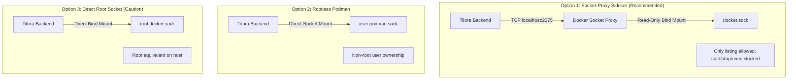

# Container Host Management & Socket Security

The Container widget supports monitoring multiple Docker and Podman hosts. Because access to the Docker Engine socket is root-equivalent on the host, Tilora strongly recommends using locked-down socket proxies.

---

## Connection Architectures



---

## 1. `socket-proxy` Sidecar (Recommended)

Uncomment the `socket-proxy` service in `docker-compose.yml`:

```yaml
socket-proxy:
  image: ghcr.io/tecnativa/docker-socket-proxy:latest
  environment:
    - CONTAINERS=1 # Allow read-only container listing
    - POST=0       # Disallow state modification
  volumes:
    - /var/run/docker.sock:/var/run/docker.sock:ro
  restart: unless-stopped
```

In Tilora (**Settings → Admin settings → Container hosts**), point your host at:
- **Connection**: `TCP`
- **Host**: `socket-proxy` (or localhost)
- **Port**: `2375`

---

## 2. Rootless Podman Setup

For rootless Podman installations:
1. Enable the user socket:
   ```bash
   systemctl --user enable --now podman.socket
   loginctl enable-linger $USER
   ```
2. Socket path: `/run/user/<uid>/podman/podman.sock` (or `$XDG_RUNTIME_DIR/podman/podman.sock`).
3. Point Tilora's connection at `socket` with this path.

---

## 3. Adding Multi-Host Endpoints

Navigate to **Settings → Admin settings → Container hosts**:
- Enter a unique **Host Name** (e.g. `"Media Server"`, `"RPi Kiosk"`, `"NAS Docker"`).
- Select Engine: `Docker` or `Podman`.
- Configure TCP host/port or Unix socket path.
- Tap **Save**. All configured hosts become switchable in the Container widget's detail view.
