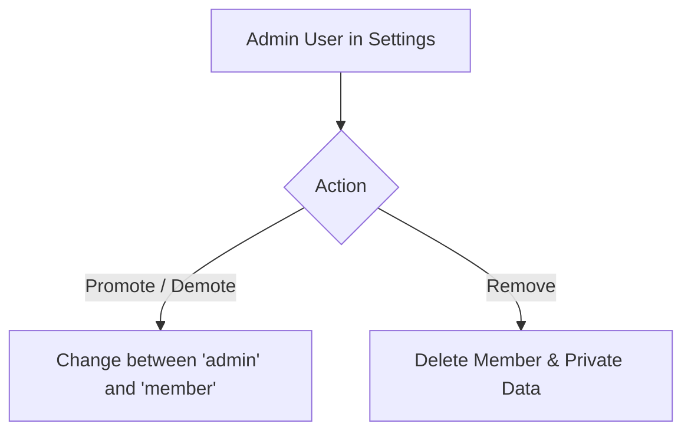

# Household Member Management

Admins can manage all household member profiles from **Settings → Admin settings → Household members**.

---

## Member Management Operations

### Promoting & Demoting Members
- Any admin can promote a standard member to admin by tapping **Promote to admin**.
- An admin can be demoted to standard member by tapping **Demote to member**.
- Tilora requires at least one admin account to remain in the system at all times.

### Removing Members
- Tap **Remove** next to any member profile.
- Confirming removal permanently deletes that member's stored preferences, private to-do list, credentials, and custom widget layouts across all household devices.
- You cannot delete your own active profile from this section (use **Delete this profile** under *Your settings* to remove yourself and log out).
