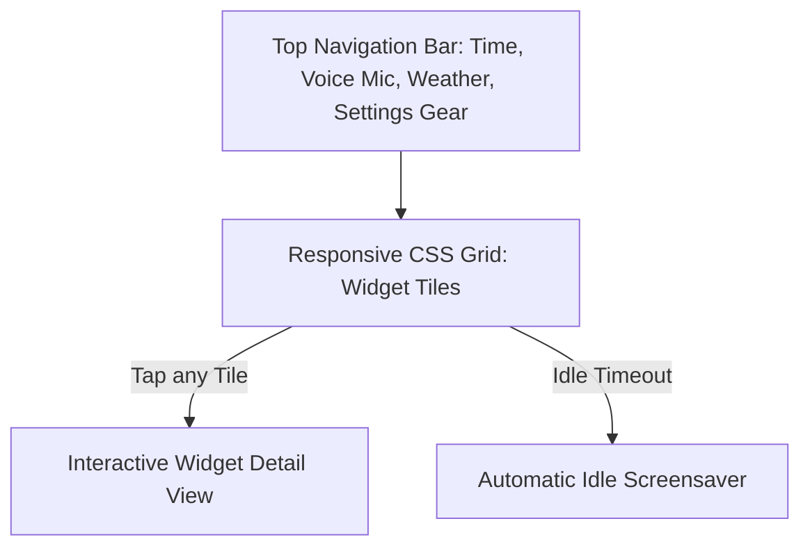

# Quick Start Guide

Welcome to Tilora! This guide walks you through the first-time setup, onboarding wizard, and basic dashboard concepts.

---

## 1. Accessing the Dashboard

Once the services or containers are running, navigate to:

- **Local Kiosk / Host**: `http://localhost:5173` (native dev) or `http://localhost:3000` (Docker / Production native)
- **Other Devices on your Local Network**: `http://<host-ip>:5173` or `http://<host-ip>:3000`

---

## 2. First-Time Setup Wizard

On your first visit, Tilora greets you with the initial household setup screen:

1. **Create the First Profile (Household Admin)**:
    - **Name**: Enter your name (e.g. `Alex` or `Mom`).
    - **Avatar**: Choose an optional emoji avatar (e.g. 🐱, 🚀, ☕).
    - **PIN (Optional)**: Set a 4–8 digit PIN to protect your profile.
2. **First Admin Role**:
    - The very first account created automatically receives the **Admin** role, giving you full access to configure household-wide settings, add/remove members, and connect network services.
3. **Name This Device**:
    - Give your current screen a friendly name (e.g., `"Kitchen Tablet"`, `"Living Room TV"`, or `"Alex's iPhone"`). This lets you customize different widget layouts per screen!

---

## 3. The Dashboard at a Glance

- **Top Bar**:
    - Current time and date.
    - AI Voice Assistant microphone button.
    - Quick link to Reports / Diagnostics.
    - Settings gear icon (opens user preferences & admin settings).
- **Widget Tiles**:
    - Live summaries for Weather, To-Do, Flights, Media, Network, and more.
    - **Tap or click any tile** to open its full-screen interactive detail page.
- **Rearranging & Resizing Tiles**:
    - Long-press (touch) or drag (mouse) any tile to move it to a new grid position.
    - Grab the corner resize handle to expand or shrink tiles.

---

## 4. Next Steps

- Explore the [User Guide](../user-guide/overview.md) to learn about gestures, tabs, and voice commands.
- Check the [Admin Guide](../admin-guide/overview.md) to set up AI providers, voice engines, and network integrations.
- Browse the [Widget Catalog](../user-guide/widgets/overview.md) to see all 30+ available plugins.
