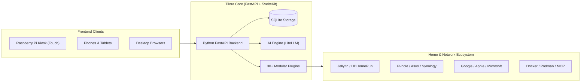

# Welcome to Tilora

**Tilora** is an open-source, customizable smart-display dashboard and lightweight home server designed for Raspberry Pi, Debian, Ubuntu, and Docker environments.

Whether run as a dedicated, full-screen touchscreen kiosk in your kitchen or living room, or as a home dashboard accessible from any phone, tablet, or PC on your local network, Tilora brings your household information, media, network services, and personal utilities into a single, cohesive interface.

---

## Key Highlights

- **Modular Plugin Architecture**: Every widget is a plugin (`backend/app/plugins/`). Tap any tile on the dashboard to drill into an interactive detail view.
- **Provider-Agnostic AI Assistant**: Integrated AI layer powered by LiteLLM supporting Anthropic (Claude), OpenAI (GPT/o-series), and Google Gemini. Features scheduled prompts (e.g. daily morning briefing) with tool calling across local plugins, SearXNG web search, and external Model Context Protocol (MCP) servers.
- **Voice Assistant**: Touch-to-talk or always-on wake-word detection (`"Tilora"`), with support for browser-native speech recognition or self-hosted/cloud Speech-to-Text (Whisper) and Text-to-Speech (Piper / OpenAI).
- **Comprehensive Home & Homelab Integrations**:
    - **Media & Entertainment**: Jellyfin media server, HDHomeRun live TV with hardware-accelerated transcoding, TMDB movies & TV shows with JustWatch availability, Goodreads, Steam, Battlefield stats.
    - **Homelab & Network Monitoring**: Pi-hole DNS ad-blocking, Asus router SSH monitoring with port scanning, Synology NAS storage and drive health, multi-host Docker & Podman containers, host resource monitor.
    - **Personal & Household Productivity**: Google Calendar, Microsoft 365, CalDAV (iCloud/Nextcloud/Fastmail), personal To-Do checklists, shared shopping lists, 17Track parcel tracking, RSS news reader, bookmarks launcher.
    - **Smart Display Features**: Open-Meteo weather with air quality & pollen, OpenSky ADS-B flight radar, interactive Leaflet maps with directions and nearby places, photos slideshow (local filesystem, iCloud shared albums, private iCloud library, Immich), customizable clock faces, retro screensavers with digital rain and LED dot-matrix animations.
- **Four-Tier Settings & Security Architecture**: Clean separation between Household Admin settings, User-level preferences, Widget-instance settings, and per-device display overrides.
- **Flexible Deployment**: One-line native Linux installer, dedicated Raspberry Pi touchscreen kiosk configuration, systemd services with sandboxing, and production-ready Docker Compose images published to GHCR.

---

## Documentation Roadmap

-   :material-rocket-launch:{ .lg .middle } __Getting Started__

    ---

    Install Tilora in minutes using our one-line installer, configure native systemd services, or launch with Docker.

    [:octicons-arrow-right-24: Getting Started](getting-started/installation.md)

-   :material-view-dashboard:{ .lg .middle } __User Guide__

    ---

    Explore dashboard gestures, multi-tab navigation, user profiles, voice assistant commands, screensavers, and personal preferences.

    [:octicons-arrow-right-24: User Guide](user-guide/overview.md)

-   :material-widgets:{ .lg .middle } __Widget Catalog__

    ---

    Detailed guides for all 34 built-in plugins, including configuration parameters, data sources, detail views, and tips.

    [:octicons-arrow-right-24: Widget Catalog](user-guide/widgets/overview.md)

-   :material-shield-crown:{ .lg .middle } __Admin Guide__

    ---

    Configure household members, AI providers, voice engines, calendar OAuth, network integrations, and hardware acceleration.

    [:octicons-arrow-right-24: Admin Guide](admin-guide/overview.md)

-   :material-server:{ .lg .middle } __Deployment & Kiosk__

    ---

    Hardware setup, Raspberry Pi OS kiosk tuning, Chromium autoplay policies, systemd sandboxing, and troubleshooting.

    [:octicons-arrow-right-24: Deployment Guide](deployment/raspberry-pi-kiosk.md)

