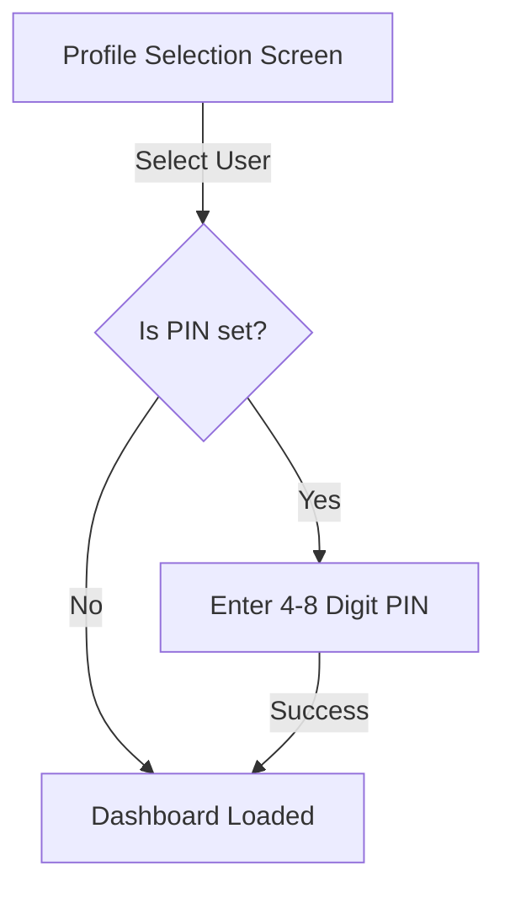

# Household Profiles & Security

Tilora is built from the ground up for shared households. Multiple family members can use the same physical touchscreen or connect from their personal devices with their own customized dashboards, private to-do lists, and reading feeds.

---

## User Profiles

Each household member has a profile consisting of:
- **Name**: Displayed on login and personalized widgets (e.g. `Sarah`).
- **Avatar**: An emoji representing the user (e.g. 🐶, 🎨, 🌟).
- **Role**: `admin` or `member`.
- **PIN Code (Optional)**: A 4 to 8 digit numeric security code.

---

## Switching Profiles & Logging In

When you open Tilora on any screen:

1. **Profile Picker**: Tap your profile avatar from the list of household members.
2. **PIN Pad**: If a PIN is configured, enter your digits.
3. **Session Cookie**: Tilora sets an encrypted HTTP-only session cookie that persists your login on that specific browser/device.

To switch profiles at any time, tap the profile icon in the top navigation bar or go to **Settings → Profile → Log out**.

---

## The Four Settings Tiers

To balance shared convenience with individual privacy, settings in Tilora belong to one of four distinct tiers:

| Tier | Description | Examples | Who Can Edit? |
|---|---|---|---|
| **1. Household Admin** | Shared across the entire house; applies to all devices. | AI model keys, Timezone, NAS/Router credentials, Pi-hole URL. | **Admins only** |
| **2. Personal (User-Level)** | Follows a user across **every** device they sign into. | Private To-Do items, Goodreads shelf, iCloud Photos login, personal RSS subscriptions, AI voice choice. | **The Profile Owner** |
| **3. Widget Instance** | Configuration specific to a single tile on the grid. | Which city a specific Weather tile tracks, custom title on a Message tile. | **Admins** (for shared widgets) or **Owner** (for custom widgets) |
| **4. Device Pair** | Specific to a single `(user, device)` combination. | Grid layout (col/row positions), hidden tiles, screen-specific playback overrides. | **Current User on that Device** |

---

## Changing Your Profile & PIN

Navigate to **Settings → Your Settings → Profile**:
- Update your display name or emoji avatar.
- Set a new PIN or tap **Clear PIN** to remove PIN protection.
- Tap **Delete Profile** if you wish to remove your profile from the household (requires at least one other admin profile to remain).
