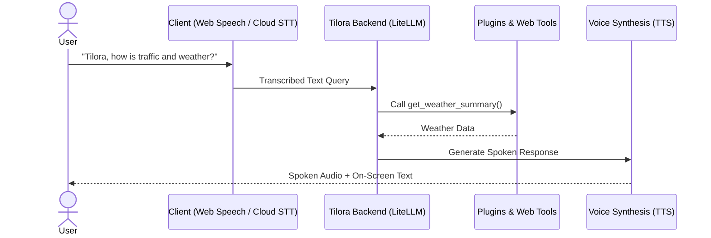

# Voice Assistant

Tilora features an AI voice assistant that can answer general questions, check current weather and forecasts, look up trending movies or games, check your calendar, inspect network status, and execute tool calls across your widgets.

---

## Interacting with the Assistant

You can activate the voice assistant in two ways:

1. **Microphone Button (Tap to Talk)**:
    - Tap the microphone icon in the top-right navigation bar.
    - Speak your query.
    - Tap again (or pause) to submit your query.
2. **Wake Word ("Tilora")**:
    - When **Always-on microphone** is enabled in your settings, simply say *"Hey Tilora"* or *"Tilora"* followed by your question (e.g. *"Tilora, what's on my calendar today?"*).

---

## Example Voice Queries

- **Weather & Forecasts**:
    - *"What's the weather today?"*
    - *"Will it rain this weekend?"*
    - *"What is the air quality right now?"*
- **Household & Planning**:
    - *"What events do I have on my calendar tomorrow?"*
    - *"What's on the household shopping list?"*
    - *"Add oat milk to the shopping list."*
    - *"What chores are left on my to-do list?"*
- **Homelab & Media**:
    - *"Are all docker containers healthy?"*
    - *"What's playing on live TV?"*
    - *"What are the trending movies this week?"*
    - *"Did my tracked packages arrive?"*
- **General Knowledge & Live Web Search**:
    - *"Who won the Cowboys game yesterday?"*
    - *"Search the web for the nearest hardware store hours."*

---

## Voice Settings & Customization

Navigate to **Settings → Your Settings → Voice**:

- **Voice Source**:
    - **This device's built-in voices**: Uses your browser/OS speech synthesizer (free, low-latency, works offline).
    - **OpenAI (Cloud)**: Natural, highly expressive voices synthesized via OpenAI's TTS API (`alloy`, `echo`, `fable`, `onyx`, `nova`, `shimmer`).
    - **Piper (Self-Hosted)**: High-quality local neural text-to-speech running on your home server without cloud dependencies.
- **Voice Selection**: Choose your preferred voice persona from the dropdown and tap **Preview voice** to hear a sample.
- **Always-on Microphone**: Toggle continuous listening on the dashboard for the wake word.

> [!NOTE]
> For admin instructions on enabling Whisper Cloud Speech-to-Text, Piper servers, and browser microphone permissions, see the [Admin Voice Setup Guide](../admin-guide/voice-setup.md).
